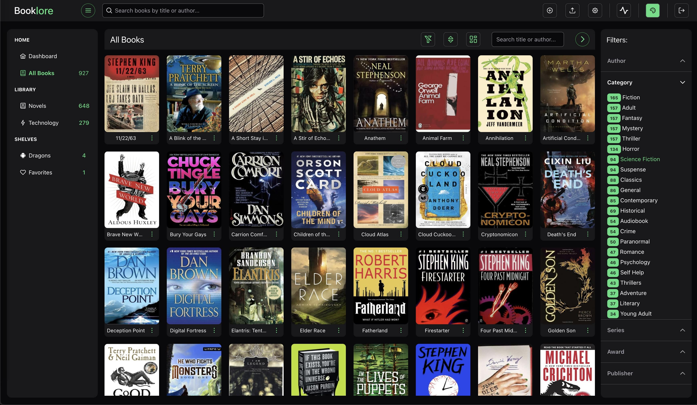

# BookLore

BookLore is a self-hosted web app for organizing and managing your personal book collection. It provides an intuitive interface to browse, read, and track your progress across PDFs and eBooks. With robust metadata management, multi-user support, and a sleek, modern UI, BookLore makes it easy to build and explore your personal library.



> ⚠️ **Warning:**  
> This project is in early development by a sole developer. Expect bugs, missing features, and frequent changes.  
> **Data Loss Risk:** Non-backwards compatible database changes may result in loss of metadata, such as book titles, authors, and reading progress. Your actual book files (PDFs and ePubs) are unlikely to be affected, but it's always a good idea to keep a backup of both your database and your book files.  
> **Limited Support:** As this is a one-person project, support may be slow, and features could be experimental or incomplete. Contributions and feedback are welcome!

## Key Features
- **Modern, Responsive UI** – A sleek, highly reactive, and fluent interface for a seamless reading experience.
- **Organized Book Management** – Categorize books using Libraries and Shelves for better organization.
- **Smart Metadata Handling** – Automatically fetch book details from sources like Goodreads, Amazon, and Google Books, or edit them manually.
- **Multi-User Support** – Admins can create user accounts, assign libraries, and manage permissions for metadata edits, uploads, and downloads.
- **Powerful eBook & PDF Reader** – A feature-rich reader for PDFs and ePubs, with per-user progress tracking and customizable reading settings.
- **And More to Come!** – Continuous improvements and exciting new features are in development.

BookLore is perfect for self-hosters who want complete control over their digital library. Stay tuned for updates!

## Deploy with Docker

You can quickly set up and run BookLore using Docker.

### 1️⃣ Install Docker & Docker Compose

Ensure you have [Docker](https://docs.docker.com/get-docker/) and [Docker Compose](https://docs.docker.com/compose/install/) installed.

### 2️⃣ Create a `.env` file

Create a `.env` file to store environment variables.

```ini
# Docker image version
BOOKLORE_IMAGE_TAG=latest

# User and timezone settings
PUID=1000
PGID=1000
TZ=Etc/UTC

# Database credentials (Replace with a secure password)
MYSQL_ROOT_PASSWORD=your_secure_password

# Paths for Docker volumes (Update these paths as per your system)
BOOKLORE_DATA_PATH=/path/to/booklore/data       # Example: /home/user/booklore/data
BOOKLORE_BOOKS_PATH=/path/to/booklore/books     # Example: /home/user/booklore/books
MARIADB_CONFIG_PATH=/path/to/mariadb/config     # Example: /home/user/booklore/mariadb/config

```

### 3️⃣ Create docker-compose.yml

Create a `docker-compose.yml` file in your project directory:

```ini
version: '3.8'

services:
  booklore:
    image: ghcr.io/adityachandelgit/booklore-app:${BOOKLORE_IMAGE_TAG}
    container_name: booklore
    env_file:
      - .env
    depends_on:
      - mariadb
    ports:
      - "6060:6060"
    volumes:
      - ${BOOKLORE_DATA_PATH}:/app/data
      - ${BOOKLORE_BOOKS_PATH}:/books

  mariadb:
    image: lscr.io/linuxserver/mariadb:11.4.5
    container_name: mariadb
    env_file:
      - .env
    volumes:
      - ${MARIADB_CONFIG_PATH}:/config
    restart: unless-stopped
```

### 4️⃣ Start the Containers

Run the following command to start the services:

```ini
docker-compose up -d
```

### 5️⃣ Access BookLore

Once the containers are up, access BookLore in your browser at:

```ini
http://localhost:6060
```

## Tech Stack

- **Backend:** Spring Boot (Java)
- **Frontend:** Angular (TypeScript)
- **Database:** MariaDB
- **Containerization:** Docker & Docker Compose  